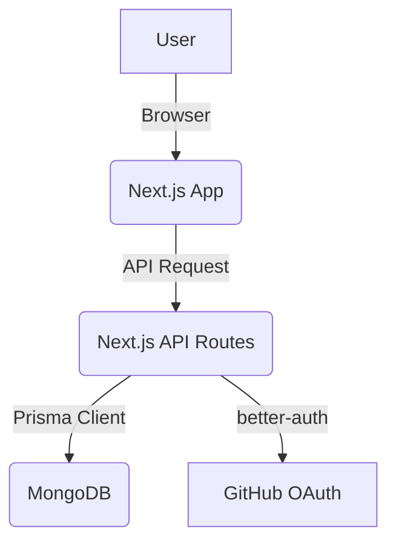

# Architecture

## System Architecture

The application is a full-stack Next.js application with a monolithic architecture. The frontend and backend are tightly coupled, with the backend being served through Next.js API routes.

## Source Code Paths

- **`app/`**: Contains the main application code, including pages, layouts, and components.
  - **`app/page.tsx`**: The main entry point for the application's UI.
  - **`app/layout.tsx`**: The root layout for the application.
  - **`app/api/`**: Contains the backend API routes.
    - **`app/api/auth/`**: Handles authentication-related API calls.
- **`lib/`**: Contains shared library code, including authentication logic and the Prisma client instance.
  - **`lib/auth.ts`**: Server-side authentication configuration.
  - **`lib/auth-client.ts`**: Client-side authentication functions.
  - **`lib/prisma.ts`**: Prisma client setup.
- **`prisma/`**: Contains the database schema.
  - **`prisma/schema.prisma`**: Defines the data models for the application.
- **`public/`**: Contains static assets like images and fonts.

## Key Technical Decisions

- **Full-Stack with Next.js**: The choice of Next.js for both frontend and backend simplifies the development process and allows for a more cohesive codebase.
- **Serverless-First**: The use of Next.js API routes and a serverless database (MongoDB Atlas) makes the application easily scalable.
- **Prisma for Database Management**: Prisma provides a type-safe and intuitive way to interact with the database, reducing the risk of runtime errors.
- **`better-auth` for Authentication**: This library simplifies the implementation of authentication, especially with social providers like GitHub.

## Data Model

The data model is defined in `prisma/schema.prisma` and consists of the following models:

- **`User`**: Represents a user of the application.
- **`Session`**: Stores user session information.
- **`Account`**: Stores user account information, including social provider details.
- **`Verification`**: Used for email verification and other verification processes.

The schema is set up for `better-auth` and does not yet contain the project-specific models (`Workspace`, `Project`, `Endpoint`).

## MVP Route Structure

This section outlines the complete URL routing structure for the Minimum Viable Product (MVP).

### 1. Public & Authentication Routes

These routes are accessible to everyone and handle user sign-up, login, and initial marketing.

- `/`

  - **Page:** Landing Page
  - **Description:** The main marketing page. Explains the app's value, shows examples, and contains calls-to-action to sign up or try the playground.

- `/auth/login`

  - **Page:** Login Page
  - **Description:** Form for existing users to sign in.

- `/auth/register`

  - **Page:** Registration Page
  - **Description:** Form for new users to create an account. A default workspace is created for them upon registration.

- `/auth/forgot-password`
  - **Page:** Forgot Password Page
  - **Description:** Standard flow for users to reset their password.

### 2. Unauthenticated Playground

A frictionless way for potential users to experience the app's core feature without commitment.

- `/play`
  - **Page:** Playground
  - **Description:** A feature-limited version of the endpoint builder. All data is saved exclusively to the browser's `localStorage`. This page should have a persistent header prompting the user to "Sign up to save your work."

### 3. Core Application Routes (Authenticated)

These routes are accessible only to logged-in users and form the core of the application.

#### Workspace Management

- `/workspaces`
  - **Page:** Workspace Picker
  - **Description:** Lists all workspaces the user belongs to. This is the destination after login if the user has more than one workspace.

#### Project & Endpoint Management (Nested under Workspaces)

- `/workspaces/[workspaceId]/dashboard`

  - **Page:** Dashboard / Project List
  - **Description:** The main view after entering a workspace. It lists all projects within the active workspace. The "Create Project" button lives here.

- `/workspaces/[workspaceId]/projects/create`

  - **Page:** Create Project Form
  - **Description:** A simple form to create a new project within the current workspace.

- `/workspaces/[workspaceId]/projects/[projectId]`

  - **Page:** Project View / Endpoint List
  - **Description:** The main view for a single project. It lists all API endpoints defined for that project. The "Create Endpoint" button also lives here.

- `/workspaces/[workspaceId]/projects/[projectId]/endpoints/create`

  - **Page:** Create Endpoint Form
  - **Description:** A form to define a new endpoint within the context of the current project and workspace.

- `/workspaces/[workspaceId]/projects/[projectId]/endpoints/[endpointId]`
  - **Page:** Endpoint View / Edit Page
  - **Description:** A dedicated page to view the details of a single endpoint. For the MVP, this page will also serve as the edit page.

#### User Account Management

- `/settings`
  - **Page:** Settings Page
  - **Description:** A single page that can be tabbed for:
    - **Profile:** Update user information (name, etc.).
    - **Account:** Change password, delete account.
    - **Workspaces:** Manage workspaces (create new, rename, etc.).
