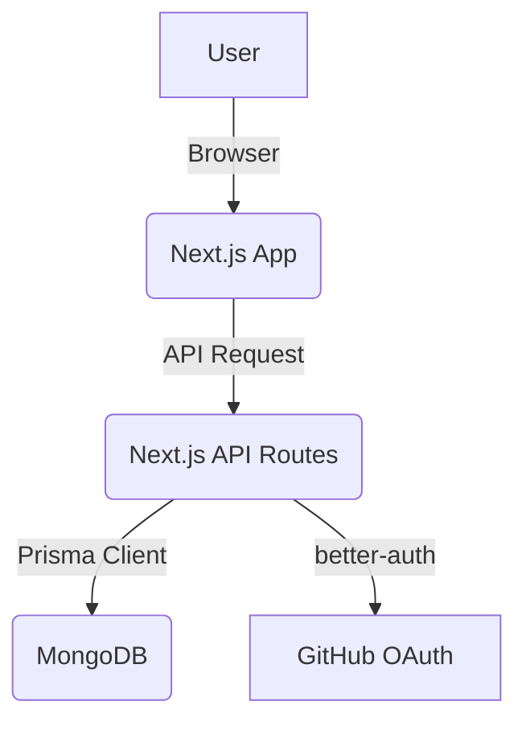

# Architecture

## System Architecture

The application is a full-stack Next.js application with a monolithic architecture. The frontend and backend are tightly coupled, with the backend being served through Next.js API routes.

## Source Code Paths

- **`app/`**: Contains the main application code, including pages, layouts, and components.
  - **`app/page.tsx`**: The main entry point for the application's UI.
  - **`app/layout.tsx`**: The root layout for the application.
  - **`app/api/`**: Contains the backend API routes.
    - **`app/api/auth/`**: Handles authentication-related API calls.
- **`lib/`**: Contains shared library code, including authentication logic and the Prisma client instance.
  - **`lib/auth.ts`**: Server-side authentication configuration.
  - **`lib/auth-client.ts`**: Client-side authentication functions.
  - **`lib/prisma.ts`**: Prisma client setup.
- **`prisma/`**: Contains the database schema.
  - **`prisma/schema.prisma`**: Defines the data models for the application.
- **`public/`**: Contains static assets like images and fonts.

## Key Technical Decisions

- **Full-Stack with Next.js**: The choice of Next.js for both frontend and backend simplifies the development process and allows for a more cohesive codebase.
- **Serverless-First**: The use of Next.js API routes and a serverless database (MongoDB Atlas) makes the application easily scalable.
- **Prisma for Database Management**: Prisma provides a type-safe and intuitive way to interact with the database, reducing the risk of runtime errors.
- **`better-auth` for Authentication**: This library simplifies the implementation of authentication, especially with social providers like GitHub.

## Data Model

The data model is defined in `prisma/schema.prisma` and consists of the following models:

- **`User`**: Represents a user of the application.
- **`Session`**: Stores user session information.
- **`Account`**: Stores user account information, including social provider details.
- **`Verification`**: Used for email verification and other verification processes.

The schema is set up for `better-auth` and does not yet contain the project-specific models (`Workspace`, `Project`, `Endpoint`).
